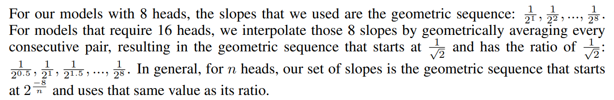
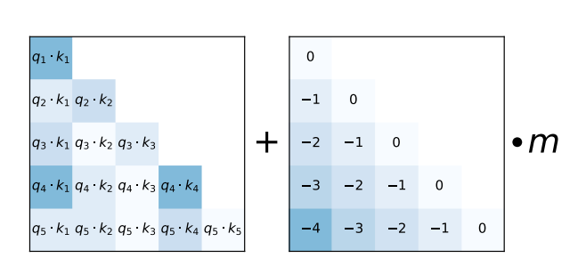
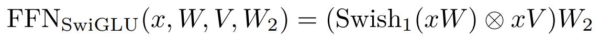

# English Explaination

the model has a tokenizer implementation and 2 new components first is ALiBi postional embedding and swishGLU acitvation and FFN function 

## 1. BPE tokenizer implementation
this tokenizer is a counter for most repeted sub-parts of the text and the algorithm is very simple

```
Initialization: Start with a vocabulary of individual characters or subword units.

Iteration:
a. Calculate the frequency of each pair of consecutive characters or subword units in your dataset.
b. Merge the most frequent pair (i.e., the pair occurring most often).
c. Update the vocabulary to include the merged pair as a new subword unit.

Repeat: Continue the process (Steps 2a-2c) for a specified number of iterations or until you reach a desired vocabulary size.

Tokenization: To tokenize text, split it into the subword units from the updated vocabulary.
```
and here is a simple code (the sources are in the main article)

```python
# this is a summized version of code in elements file
import re
import collections
import random

def get_stats(vocab):
    pairs = collections.defaultdict(int)
    for word, freq in vocab.items():
        symbols = word.split()
        for i in range(len(symbols) - 1):
            pairs[(symbols[i], symbols[i + 1])] += freq
    return pairs

def merge_vocab(pair, v_in):
    v_out = {}
    bigram = re.escape(' '.join(pair))
    p = re.compile(r'(?<!\S)' + bigram + r'(?!\S)')
    for word in v_in:
        w_out = p.sub(''.join(pair), word)
        v_out[w_out] = v_in[word]
    return v_out

# Create a random initial vocabulary from a sample text
text = "مرحبا بك في هذه المقالة المفيدة"
words_list = text.split()
new_text = [" ".join(word) for word in words_list]
vocab = {word: random.randint(1, 100) for word in new_text}

num_merges = 10

# Perform BPE tokenization for the specified number of merges
for i in range(num_merges):
    pairs = get_stats(vocab)
    best = max(pairs, key=pairs.get)
    vocab = merge_vocab(best, vocab)
    print(best)
```

## 2. ALiBi postional encoding

this is a very simple and good where it add a matrix multiplied by `m` that is a geometric sequence (original paper [link](https://arxiv.org/pdf/2108.12409.pdf))




and here is a simple code that build extremely simple head and add the postional matrix to it 

```python
import torch
from torch import nn
from torch.nn import functional as F

# inputs (window * dim)
X = torch.rand(100,256)

# Wq, Wk
head_size = 50
W_k = torch.rand(256,head_size)
W_q = torch.rand(256,head_size)
W_v = torch.rand(256,head_size)


# K, Q
K = X @ W_k # (100,256) * (256*head_size) --> (100,head_size)
Q = X @ W_q # (100,256) * (256*head_size) --> (100,head_size)
V = X @ W_v # (100,256) * (256*head_size) --> (100,head_size)
K_Q = Q@K.T # (100,head_size) * (head_size,100) --> (100,100)

# masking
wei = K_Q

# making the ALiBi (needed part)
pos_mask = torch.stack([torch.arange(0,100) for _ in range(100)])
pos_mask = pos_mask.T.float()
# pos_mask = torch.tril(pos_mask)
# for simplicity number of heads here is one (equation ratio=2^(-8/n))
n_heads = 1 
m = 2**(-8/n_heads)
pos_mask = pos_mask.tril(diagonal=-1).float()
pos_mask = -pos_mask*m
# end of it (could be done in the beggining becacuse it is fixed)

tril = torch.tril(torch.ones(100, 100))
# making the masking 
wei = wei.masked_fill(tril == 0, float('-inf'))
# Adding the pos_mask with wei before softmax
wei = F.softmax(wei+pos_mask, dim=-1)
# doing the last bit of attention
I = wei @ V
I.shape
```

and here is the code for the ALiBi alone 

```python
import torch
from torch import nn
from torch.nn import functional as F
# programming the matrix of postional encodings saparetley code

pos_mask = torch.stack([torch.arange(0,100) for _ in range(100)])
pos_mask = pos_mask.T.float()
# pos_mask = torch.tril(pos_mask)
# for simplicity number of heads here is one (equation ratio=2^(-8/n))
n_heads = 1 
m = 2**(-8/n_heads)
pos_mask = pos_mask.tril(diagonal=-1).float()
-pos_mask*m
```

## 3. swishGLU activation and its FFN 
This is a new idea for activation functions (see sources in the original paper [link](https://arxiv.org/pdf/2002.05202v1.pdf)) 



the code has a simple FFN model that uses the swishGLU activation 

```python
import torch
from torch import nn
from torch.nn import functional as F

def swish(x):
  return x*F.sigmoid(x * 1) # beta = 1 

# Example 
# tns = torch.randint(1,10,(3,3))
# print(swish(tns))

# without bias for simplicity
def swishGLU(x,W,V):
  return swish(x@W) * (x@V)

# Example 
# W = torch.rand(3,3)
# V = torch.rand(3,3)
# x = torch.randint(1,10,(1,3)).float()
# print(swishGLU(x,W,V))


# Building feed forward layer with them
class FFN_new(nn.Module):
  def __init__(self, inp,h1, out):
    super().__init__()
    self.W = nn.Linear(inp,h1)
    self.V = nn.Linear(inp,h1)
    self.W2 = nn.Linear(h1,out)

  def swishGLU(self, x,W,V):
    return swish(W(x)) * (V(x))

  def forward(self,x):
    A = self.swishGLU(x,self.W, self.V)
    B = self.W2(A)

    return B 

model = FFN_new(3,4,5)
tns = torch.rand((1,3))

y = model(tns)

y.shape

```

